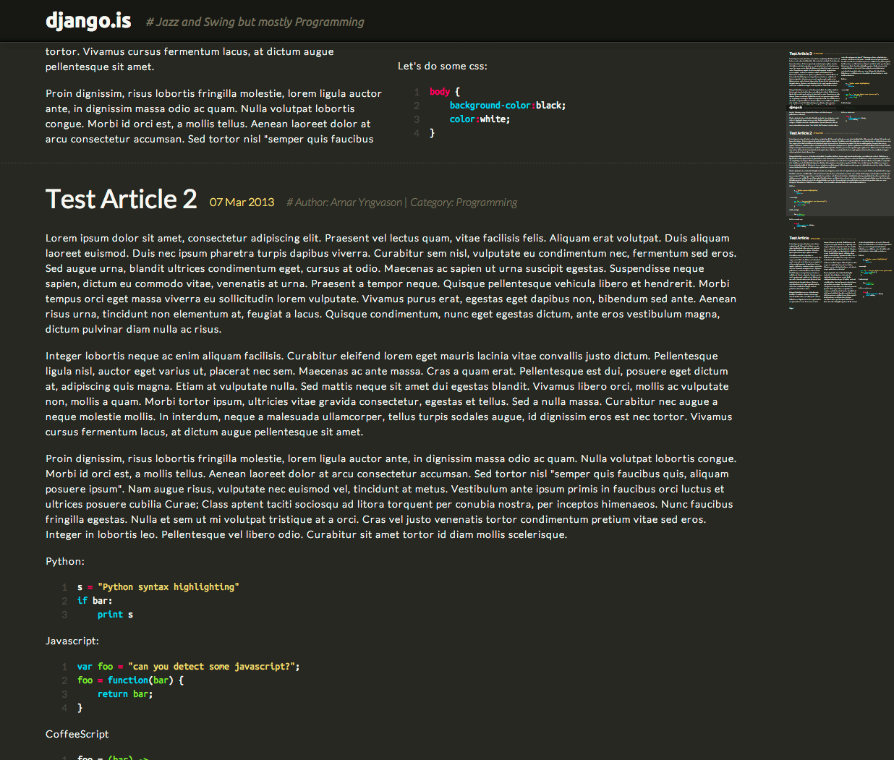

sublime-scroll
====================

"Sublime Text 2"-style scroll bars. Renders a visual scroll bar on right side of the webpage using css scaling.

Working demo: http://django.is

## Installation

###Requires:

* jQuery (http://jquery.com/)

### Settings:
Option:            | Type:  | Value: | Default:
------------------ | ------ | ------ | --------
__top__            | int    |        | 0
__bottom__         | int    |        | 0
__fixedElements__  | string | List of css selectors seperated by comma | `''`
__scrollWidth__    | int    |        | 150
__scrollHeight__   | int    |        | `function() {` `return $(window).height() - this.getTop() - this.getBottom();` `}`
__contentWidth__   | int    |        | `function() {return $(document).outerWidth(true);}`
__contentWeight__  | int    |        | `function() {return $(document).outerHeight(true);}`
__minWidth__       | int    |        | null

__NOTE:__ Any setting can be a function. I order to access other settings within a setting, use setting getters i.e. `this.getContentWidth()` or `get[AnyCamelCaseSetting]()`

See example.html for example code.
